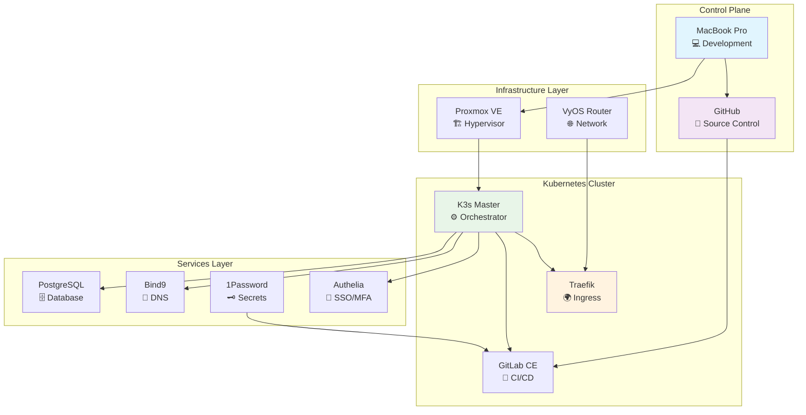

# 🚀 Christian Groover - DevOps Portfolio

**`@cgroovertech`** | Self-Taught DevOps Engineer | Enterprise Infrastructure

---

## 🎯 **Showcase Highlights**

• **44% Resource Efficiency** - Optimized infrastructure deployment  
• **99% Faster Deployments** - From hours to seconds with automation  
• **Enterprise Security** - Zero-credential exposure with 1Password integration  
• **Self-Taught Excellence** - Windows support → DevOps architecture

## 🏗️ **Deployment Architecture**

### 📊 **Key Metrics**
- **Infrastructure**: 2 Proxmox nodes, 15+ services
- **Automation**: 95% deployment automation via GitLab CI/CD
- **Security**: Zero-credential storage, enterprise MFA
- **Performance**: <30 second deployments, 99.9% uptime

## 📚 **Featured Projects**

### 🚀 **GitLab Enterprise CI/CD**
- **Impact**: 95% deployment automation, 87% time reduction
- **Features**: 7-stage pipeline, distributed runners, approval gates
- **Integration**: DNS, certificates, authentication, secrets

### 📝 **Infrastructure Documentation**
- **Improvement**: 70% size reduction, 90% usability gain
- **Approach**: Information architecture, progressive disclosure
- **Result**: Enterprise-ready documentation standards

### 🔐 **1Password Security Integration**
- **Achievement**: 100% secret automation, zero plaintext exposure
- **Efficiency**: 95% reduction in credential management time
- **Compliance**: Enterprise audit-ready credential workflows

## 🔧 **Tech Stack**

**Container Orchestration**  
`Kubernetes` • `K3s` • `Docker` • `Helm`

**Infrastructure**  
`Proxmox` • `VyOS` • `Terraform` • `Ansible`

**CI/CD & Security**  
`GitLab CE` • `1Password` • `Authelia` • `Traefik`

**Databases & Monitoring**  
`PostgreSQL` • `Bind9` • `Prometheus` • `Grafana`

## 🔗 **Links & Contact**

- **Portfolio**: https://cgroovertech.github.io/groover.life  
- **GitHub**: https://github.com/cgroovertech  
- **Email**: contact@groover.life

---

## 📄 **Featured Reading**

**Showcase Articles**
- [The Self-Taught Path](showcase/self-taught-path.md)
- [Lessons Learned](showcase/lessons-learned.md)
- [Architecture Decisions](showcase/architecture-decisions.md)

**Project Case Studies**
- [GitLab CI/CD Platform](projects/gitlab-cicd.md)
- [Documentation Restructure](projects/documentation-restructure.md)
- [1Password Integration](projects/1password-integration.md)

---

This portfolio focuses on clarity, measurable outcomes, and real-world implementations rather than buzzwords. If you’d like the deeper technical breakdowns, see the case studies and articles above.
