# 🚀 Christian Groover - DevOps Portfolio

**`@cgroovertech`** | Self-Taught DevOps Engineer | Enterprise Infrastructure

---

## 🎯 **Showcase Highlights**

• **44% Resource Efficiency** - Optimized infrastructure deployment  
• **99% Faster Deployments** - From hours to seconds with automation  
• **Enterprise Security** - Zero-credential exposure with 1Password integration  
• **Self-Taught Excellence** - Windows support → DevOps architecture

## 🏗️ **Infrastructure Architecture**

```mermaid
graph TB
    subgraph "Development & Control"
        Mac["MacBook Pro<br/>💻 Local Dev"]
        Git["GitHub<br/>💾 Source Control"]
        NetBird["NetBird VPN<br/>🌐 Mesh Network"]
    end
    
    subgraph "Proxmox Infrastructure"
        Proxmox["Proxmox VE Cluster<br/>🏗️ pve1 + pve2"]
        VyOS["VyOS Router<br/>🗺 SuperMicro Switch"]
    end
    
    subgraph "VLAN 10 - Management"
        Terraform["PCT 2010<br/>Terraform Container"]
        Ansible["PCT 2011<br/>Ansible Container"]
        Postgres["PCT 120<br/>PostgreSQL + AI"]
    end
    
    subgraph "VLAN 101 - Edge Services"
        Traefik["PCT 111<br/>🌍 Traefik Proxy"]
    end
    
    subgraph "VLAN 110 - Applications"
        GitLab["PCT 119<br/>🤖 GitLab CE"]
        Grafana["PCT 121<br/>📈 Grafana"]
        Prometheus["PCT 122<br/>🔭 Prometheus"]
        Wazuh["PCT 123<br/>🔒 Wazuh SIEM"]
    end
    
    subgraph "VLAN 120 - Authentication"
        Bind9["PCT 109<br/>🎯 Bind9 DNS"]
        StepCA["PCT 114<br/>🔒 Step-CA"]
        LLDAP["PCT 117<br/>🗂 LLDAP Directory"]
        Authelia["PCT 118<br/>🔐 Authelia SSO"]
    end
    
    subgraph "External Services"
        OnePass["1Password<br/>🗝️ Enterprise Vault"]
    end
    
    Mac -.-> NetBird
    NetBird --> Proxmox
    Mac --> Git
    Git --> GitLab
    Proxmox --> VyOS
    VyOS --> Traefik
    
    Terraform --> Proxmox
    Ansible --> Terraform
    Ansible --> GitLab
    GitLab --> Terraform
    GitLab --> Ansible
    
    Traefik --> GitLab
    Traefik --> Authelia
    Authelia --> LLDAP
    StepCA --> Traefik
    StepCA --> GitLab
    Bind9 -.-> Authelia
    Bind9 -.-> GitLab
    Bind9 -.-> Traefik
    
    OnePass --> GitLab
    OnePass --> Ansible
    Postgres --> GitLab
    
    Prometheus --> Grafana
    Prometheus -.-> Traefik
    Prometheus -.-> GitLab
    Prometheus -.-> Postgres
    Wazuh -.-> Traefik
    Wazuh -.-> GitLab
    Wazuh -.-> Authelia
    Grafana --> Traefik
    
    style Mac fill:#2196f3,stroke:#1976d2,color:#fff
    style Git fill:#4caf50,stroke:#388e3c,color:#fff
    style NetBird fill:#ff9800,stroke:#f57c00,color:#fff
    style Proxmox fill:#9c27b0,stroke:#7b1fa2,color:#fff
    style VyOS fill:#607d8b,stroke:#455a64,color:#fff
    style Traefik fill:#00bcd4,stroke:#0097a7,color:#fff
    style GitLab fill:#e91e63,stroke:#c2185b,color:#fff
    style Bind9 fill:#3f51b5,stroke:#303f9f,color:#fff
    style StepCA fill:#795548,stroke:#5d4037,color:#fff
    style LLDAP fill:#8bc34a,stroke:#689f38,color:#fff
    style Authelia fill:#ff5722,stroke:#e64a19,color:#fff
    style OnePass fill:#2196f3,stroke:#1976d2,color:#fff
    style Terraform fill:#673ab7,stroke:#512da8,color:#fff
    style Ansible fill:#f44336,stroke:#d32f2f,color:#fff
    style Postgres fill:#009688,stroke:#00796b,color:#fff
    style Grafana fill:#ff9800,stroke:#f57c00,color:#fff
    style Prometheus fill:#e91e63,stroke:#c2185b,color:#fff
    style Wazuh fill:#9c27b0,stroke:#7b1fa2,color:#fff
```

### 🌐 **Network Architecture**

```mermaid
graph TD
    Internet["Internet<br/>🌍 External"]
    VyOS["VyOS Router<br/>🗺 Gateway"]
    Switch["SuperMicro Switch<br/>🔌 SSE-G2252"]
    
    subgraph "VLAN 10 - Management (10.0.10.0/24)"
        T["PCT 2010<br/>Terraform"]
        A["PCT 2011<br/>Ansible"]
        P["PCT 120<br/>PostgreSQL"]
    end
    
    subgraph "VLAN 101 - Edge (10.0.101.0/24)"
        TR["PCT 111<br/>Traefik"]
    end
    
    subgraph "VLAN 110 - Apps (10.0.110.0/24)"
        GL["PCT 119<br/>GitLab"]
        GR["PCT 121<br/>Grafana"]
        PR["PCT 122<br/>Prometheus"]
        WZ["PCT 123<br/>Wazuh"]
    end
    
    subgraph "VLAN 120 - Auth (10.0.120.0/24)"
        B["PCT 109<br/>Bind9"]
        S["PCT 114<br/>Step-CA"]
        L["PCT 117<br/>LLDAP"]
        AU["PCT 118<br/>Authelia"]
    end
    
    Internet --> VyOS
    VyOS --> Switch
    Switch --> T
    Switch --> A
    Switch --> P
    Switch --> TR
    Switch --> GL
    Switch --> GR
    Switch --> PR
    Switch --> WZ
    Switch --> B
    Switch --> S
    Switch --> L
    Switch --> AU
    
    style Internet fill:#ff5722,stroke:#d32f2f,color:#fff
    style VyOS fill:#607d8b,stroke:#455a64,color:#fff
    style Switch fill:#795548,stroke:#5d4037,color:#fff
    style T fill:#673ab7,stroke:#512da8,color:#fff
    style A fill:#f44336,stroke:#d32f2f,color:#fff
    style P fill:#009688,stroke:#00796b,color:#fff
    style TR fill:#00bcd4,stroke:#0097a7,color:#fff
    style GL fill:#e91e63,stroke:#c2185b,color:#fff
    style GR fill:#ff9800,stroke:#f57c00,color:#fff
    style PR fill:#e91e63,stroke:#c2185b,color:#fff
    style WZ fill:#9c27b0,stroke:#7b1fa2,color:#fff
    style B fill:#3f51b5,stroke:#303f9f,color:#fff
    style S fill:#795548,stroke:#5d4037,color:#fff
    style L fill:#8bc34a,stroke:#689f38,color:#fff
    style AU fill:#ff5722,stroke:#e64a19,color:#fff
```

### 🗜 **Storage & Network Bonding**

```mermaid
graph TD
    Switch["SuperMicro SSE-G2252<br/>🔌 Managed Switch"]
    
    subgraph "LACP Port Channels"
        LACP1["Port Channel 1<br/>🔗 PVE1 Bonding"]
        LACP2["Port Channel 2<br/>🔗 Synology LACP"]
        LACP3["Port Channel 3<br/>🔗 ReadyNas LACP"]
    end
    
    subgraph "Storage Infrastructure"
        Synology["Synology NAS<br/>🗜 32TB RAID 10<br/>12-Disk Array"]
        ReadyNas["Netgear ReadyNas<br/>🗜 Enterprise Storage"]
        PVE1["Proxmox PVE1<br/>🏗️ Cluster Node"]
    end
    
    Switch --> LACP1
    Switch --> LACP2
    Switch --> LACP3
    
    LACP1 --> PVE1
    LACP2 --> Synology
    LACP3 --> ReadyNas
    
    style Switch fill:#795548,stroke:#5d4037,color:#fff
    style LACP1 fill:#4caf50,stroke:#388e3c,color:#fff
    style LACP2 fill:#4caf50,stroke:#388e3c,color:#fff
    style LACP3 fill:#4caf50,stroke:#388e3c,color:#fff
    style Synology fill:#ff9800,stroke:#f57c00,color:#fff
    style ReadyNas fill:#9c27b0,stroke:#7b1fa2,color:#fff
    style PVE1 fill:#2196f3,stroke:#1976d2,color:#fff
```

### 🌐 **Site-to-Site VPN Architecture**

```mermaid
graph LR
    subgraph "Primary Site - 10.0.0.0/16"
        HomeLab["Homelab Network<br/>🏗️ 10.0.0.0/16"]
        NetBirdA["NetBird Peer A<br/>🔗 Routing Peer"]
        VyOSA["VyOS Router<br/>🗺 Gateway"]
    end
    
    subgraph "NetBird Cloud"
        NetBirdCloud["NetBird Controller<br/>☁️ Mesh Management"]
        ACLEngine["ACL Engine<br/>🔒 Policy Control"]
    end
    
    subgraph "Remote Site - 192.168.0.0/24"
        RemoteNet["Remote Network<br/>🏠 192.168.0.0/24"]
        NetBirdB["NetBird Peer B<br/>🔗 Routing Peer"]
        RemoteGW["Remote Gateway<br/>🗺 Router"]
    end
    
    subgraph "Network Policies"
        Policy1["Allow: Management<br/>✅ 10.0.10.0/24 → 192.168.0.0/24"]
        Policy2["Block: Direct Access<br/>❌ Services → Remote"]
        Policy3["Route: Specific Subnets<br/>🔀 Selective Routing"]
    end
    
    HomeLab --> NetBirdA
    NetBirdA -.-> NetBirdCloud
    NetBirdCloud -.-> NetBirdB
    NetBirdB --> RemoteNet
    
    VyOSA --> NetBirdA
    RemoteGW --> NetBirdB
    
    NetBirdCloud --> ACLEngine
    ACLEngine -.-> Policy1
    ACLEngine -.-> Policy2
    ACLEngine -.-> Policy3
    
    style HomeLab fill:#2196f3,stroke:#1976d2,color:#fff
    style NetBirdA fill:#ff9800,stroke:#f57c00,color:#fff
    style NetBirdCloud fill:#4caf50,stroke:#388e3c,color:#fff
    style ACLEngine fill:#f44336,stroke:#d32f2f,color:#fff
    style RemoteNet fill:#9c27b0,stroke:#7b1fa2,color:#fff
    style NetBirdB fill:#ff9800,stroke:#f57c00,color:#fff
    style Policy1 fill:#4caf50,stroke:#388e3c,color:#fff
    style Policy2 fill:#f44336,stroke:#d32f2f,color:#fff
    style Policy3 fill:#ff9800,stroke:#f57c00,color:#fff
    style VyOSA fill:#607d8b,stroke:#455a64,color:#fff
    style RemoteGW fill:#607d8b,stroke:#455a64,color:#fff
```

### 📈 **Production Infrastructure**

**Compute & Network**
- **Proxmox VE Cluster**: 2 nodes (pve1, pve2) with LACP bonding
- **LXC Containers**: 14 total containers (9 services + 2 automation + 3 monitoring)
- **Network**: VyOS router + SuperMicro SSE-G2252 managed switch
- **VPN**: NetBird mesh with site-to-site routing
- **Port Channels**: 3 LACP configurations for redundancy

**Site-to-Site Connectivity**
- **Primary Network**: 10.0.0.0/16 (homelab infrastructure)
- **Remote Network**: 192.168.0.0/24 (branch office/remote site)
- **Routing Peers**: NetBird peers with selective subnet routing
- **ACL Controls**: Policy-based access control between networks
- **Management Access**: Controlled 10.0.10.0/24 → 192.168.0.0/24 routing

**Storage Infrastructure**
- **Synology NAS**: 32TB RAID 10, 12-disk array with LACP
- **Netgear ReadyNas**: Enterprise storage with LACP bonding
- **High Availability**: Redundant storage paths and failover

**Service Architecture**
- **VLAN Segmentation**: 4 VLANs (Management, Edge, Apps, Auth)
- **DNS**: Bind9 authoritative server for .lan domains
- **TLS**: Step-CA private certificate authority
- **Identity**: LLDAP + Authelia enterprise SSO/MFA
- **CI/CD**: GitLab CE with distributed runners
- **Database**: PostgreSQL with AI/ML extensions

**Monitoring & Security**
- **Metrics**: Prometheus + Grafana dashboards
- **SIEM**: Wazuh security monitoring and threat detection
- **Zero-credential storage**: 1Password enterprise integration
- **GitOps workflow**: Infrastructure as Code with approval gates
- **95% automation**: Terraform + Ansible + GitLab pipelines

## 📚 **Featured Projects**

### 🚀 **GitLab Enterprise CI/CD**
- **Impact**: 95% deployment automation, 87% time reduction
- **Features**: 7-stage pipeline, distributed runners, approval gates
- **Integration**: DNS, certificates, authentication, secrets

### 🌐 **Advanced Networking & VPN**
- **Site-to-Site**: NetBird routing between 10.0.0.0/16 and 192.168.0.0/24
- **Access Control**: Policy-based ACL routing with selective subnet access
- **High Availability**: LACP bonding across Proxmox, NAS, and network infrastructure
- **Security**: Zero-trust mesh networking with encrypted peer-to-peer tunnels

### 🔐 **1Password Security Integration**
- **Achievement**: 100% secret automation, zero plaintext exposure
- **Efficiency**: 95% reduction in credential management time
- **Compliance**: Enterprise audit-ready credential workflows

## 🔧 **Tech Stack**

**Container Orchestration**  
`Kubernetes` • `K3s` • `Docker` • `Helm` • `LXC`

**Infrastructure**  
`Proxmox VE` • `VyOS` • `Terraform` • `Ansible` • `NetBird`

**Advanced Networking**  
`Site-to-Site VPN` • `ACL Routing` • `LACP Bonding` • `VLAN Trunking` • `Mesh Networking`

**Storage & Hardware**  
`SuperMicro SSE-G2252` • `Synology RAID 10` • `ReadyNas` • `32TB Arrays`

**CI/CD & Security**  
`GitLab CE` • `1Password` • `Authelia` • `Traefik` • `Wazuh SIEM`

**Monitoring & Data**  
`Prometheus` • `Grafana` • `PostgreSQL` • `Bind9` • `Step-CA`

## 🔗 **Links & Contact**

- **Portfolio**: https://cgroovertech.github.io/groover.life  
- **GitHub**: https://github.com/cgroovertech  
- **Email**: contact@groover.life

---

## 📄 **Featured Reading**

**Showcase Articles**
- [The Self-Taught Path](showcase/self-taught-path.md)
- [Lessons Learned](showcase/lessons-learned.md)
- [Architecture Decisions](showcase/architecture-decisions.md)

**Project Case Studies**
- [GitLab CI/CD Platform](projects/gitlab-cicd.md)
- [Documentation Restructure](projects/documentation-restructure.md)
- [1Password Integration](projects/1password-integration.md)

---

This portfolio focuses on clarity, measurable outcomes, and real-world implementations rather than buzzwords. If you’d like the deeper technical breakdowns, see the case studies and articles above.
