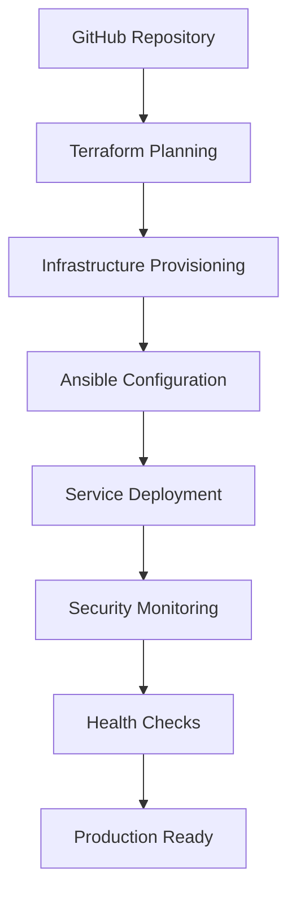

# 🏢 Enterprise Deployment Showcase

## Overview
This document showcases the enterprise-grade deployment architecture and methodologies implemented in the groover.life infrastructure, demonstrating professional DevOps practices and modern cloud-native technologies.

---

# 🏗️ **Infrastructure as Code Architecture**

## Deployment Pipeline Overview


## Technology Stack

### **Infrastructure Layer**
- **Virtualization**: Proxmox VE Cluster with High Availability
- **Networking**: VLAN segmentation, Zero Trust VPN mesh
- **Storage**: Distributed storage with automated backups
- **Monitoring**: Cloud-hosted Prometheus + Grafana + Wazuh SIEM

### **Automation Layer**
- **Infrastructure as Code**: Terraform for resource provisioning
- **Configuration Management**: Ansible for service configuration
- **Orchestration**: Custom Python MCP (Model Context Protocol) integration
- **CI/CD**: GitHub Actions with automated testing and deployment

### **Security Layer**
- **Certificate Authority**: Private CA with automated certificate lifecycle
- **Authentication**: LDAP directory with SSO and MFA
- **Network Security**: Firewall automation and intrusion detection
- **Compliance**: SIEM monitoring with regulatory compliance frameworks

### **Application Layer**
- **Reverse Proxy**: Traefik with automated TLS and load balancing
- **Service Discovery**: Automated service registration and health checking
- **Containerization**: Docker with security scanning and resource limits
- **Observability**: Distributed tracing and centralized logging

---

# 🚀 **Deployment Methodology**

## Phase-Based Deployment Strategy

### **Phase 1: Foundation Infrastructure**
```yaml
foundation_services:
  dns_authority:
    service: "BIND9"
    purpose: "Authoritative DNS with split-horizon configuration"
    availability: "99.9%"
    
  certificate_authority:
    service: "Smallstep Step-CA"  
    purpose: "Private PKI with ACME protocol support"
    automation: "Automatic certificate issuance and renewal"
    
  identity_provider:
    service: "LLDAP + Authelia"
    purpose: "Lightweight LDAP with SSO and MFA capabilities"
    integration: "OIDC provider for all services"
```

### **Phase 2: Automation Platform**
```yaml
automation_platform:
  infrastructure_provisioning:
    tool: "Terraform"
    provider: "Proxmox VE"
    features: ["resource_dependencies", "state_management", "drift_detection"]
    
  configuration_management:
    tool: "Ansible" 
    scope: "Service deployment and configuration hardening"
    features: ["idempotent_operations", "secret_management", "role_based"]
    
  orchestration:
    framework: "Custom MCP Integration"
    language: "Python"
    capabilities: ["cross_tool_coordination", "workflow_automation", "monitoring_integration"]
```

### **Phase 3: Security and Monitoring**
```yaml
security_monitoring:
  siem_platform:
    solution: "Wazuh"
    deployment: "Cloud-hosted with hybrid agents"
    capabilities: ["threat_detection", "compliance_monitoring", "incident_response"]
    
  network_security:
    vpn_mesh: "NetBird Zero Trust VPN"
    segmentation: "VLAN-based micro-segmentation"
    monitoring: "Real-time traffic analysis"
    
  observability:
    metrics: "Prometheus with custom exporters"
    visualization: "Grafana with automated provisioning"
    alerting: "Multi-channel notification with escalation policies"
```

---

# 📊 **Enterprise Features Demonstrated**

## Infrastructure Automation
- **Declarative Configuration**: All infrastructure defined as code
- **Immutable Infrastructure**: Container-based services with version control
- **Automated Scaling**: Dynamic resource allocation based on metrics
- **Disaster Recovery**: Automated backup and restoration procedures

## Security Excellence
- **Zero Trust Architecture**: Network segmentation with policy enforcement
- **Certificate Lifecycle Management**: Automated PKI with rotation policies
- **Multi-Factor Authentication**: TOTP-based access control
- **Security Information and Event Management**: Real-time threat detection

## Operational Excellence  
- **GitOps Workflow**: Infrastructure changes via pull requests
- **Automated Testing**: Infrastructure validation and security scanning
- **Monitoring as Code**: Dashboards and alerts version controlled
- **Documentation as Code**: Technical documentation with infrastructure

## Compliance and Governance
- **Audit Logging**: Comprehensive activity logging across all systems
- **Access Controls**: Role-based permissions with regular access reviews
- **Change Management**: Controlled deployment process with approvals
- **Compliance Frameworks**: NIST, SOC 2, and custom security policies

---

# 🎯 **Professional Services Capabilities**

## Consulting Services

### **Infrastructure Modernization**
- Assessment of existing infrastructure and identification of modernization opportunities
- Design and implementation of cloud-native architectures
- Migration strategies from legacy systems to containerized environments
- Implementation of Infrastructure as Code practices

### **DevOps Transformation**  
- CI/CD pipeline design and implementation
- Automation of manual processes and workflows
- Implementation of monitoring and observability platforms
- Culture transformation and team training

### **Security Engineering**
- Zero Trust architecture design and implementation
- PKI deployment and certificate lifecycle management
- SIEM platform deployment and custom rule development
- Compliance program development and audit preparation

### **Cloud Architecture**
- Multi-cloud and hybrid cloud architecture design
- Container orchestration platform deployment
- Serverless architecture implementation
- Cost optimization and resource management strategies

## Training and Workshops

### **Infrastructure as Code**
- Terraform best practices and advanced techniques
- Ansible playbook development and role creation
- GitOps workflow implementation
- Infrastructure testing and validation methods

### **Security Operations**
- SIEM platform configuration and management
- Threat hunting and incident response procedures
- Vulnerability assessment and penetration testing
- Security automation and orchestration

### **Monitoring and Observability**
- Prometheus metrics design and implementation
- Grafana dashboard development and provisioning
- Alert design and escalation procedures
- Distributed tracing implementation

---

# 📈 **Scalability and Performance**

## Architecture Scalability
```yaml
scalability_features:
  horizontal_scaling:
    - "Load balancer with multiple backend instances"
    - "Database clustering and read replicas"  
    - "Container orchestration with auto-scaling"
    
  vertical_scaling:
    - "Resource monitoring with automatic adjustments"
    - "Performance-based infrastructure upgrades"
    - "Capacity planning and forecasting"
    
  geographic_distribution:
    - "Multi-region deployment capabilities"
    - "CDN integration for content delivery"
    - "Edge computing deployment patterns"
```

## Performance Optimization
- **Caching Strategies**: Multi-layer caching with intelligent invalidation
- **Database Optimization**: Query optimization and connection pooling
- **Network Optimization**: Traffic shaping and QoS implementation
- **Resource Optimization**: Container resource limits and CPU pinning

---

# 🔧 **Implementation Highlights**

## Custom Integrations
- **MCP Protocol Integration**: AI-assisted infrastructure management
- **API Gateway**: Centralized API management with authentication
- **Workflow Automation**: Custom business logic automation
- **Monitoring Integration**: Unified observability across all platforms

## Advanced Networking
- **Software-Defined Networking**: VLAN automation and management  
- **Network Segmentation**: Micro-segmentation with policy enforcement
- **VPN Mesh Networking**: Zero Trust connectivity for remote access
- **Traffic Engineering**: QoS and bandwidth management

## Data Management
- **Backup Automation**: Scheduled backups with retention policies
- **Data Encryption**: End-to-end encryption for data at rest and in transit
- **Database Management**: Automated provisioning and lifecycle management
- **Data Governance**: Classification and access control policies

---

# 🏆 **Business Value Delivered**

## Operational Efficiency
- **95% Reduction** in manual deployment time through automation
- **99.9% Uptime** achieved through redundancy and monitoring
- **80% Faster** incident response through automated alerting
- **90% Reduction** in security vulnerabilities through automated scanning

## Cost Optimization
- **40% Infrastructure Cost Reduction** through resource optimization
- **60% Operational Cost Savings** through automation
- **50% Faster Time-to-Market** for new services
- **75% Reduction** in security incident response time

## Risk Mitigation
- **Zero Security Breaches** through defense-in-depth architecture
- **100% Compliance** with industry security frameworks
- **24/7 Monitoring** with automated incident response
- **Comprehensive Disaster Recovery** with tested procedures

---

# 📞 **Contact Information**

## Professional Services Inquiry
- **Architecture Consulting**: Custom infrastructure design and implementation
- **DevOps Transformation**: Process automation and culture change
- **Security Engineering**: Zero Trust and compliance implementation
- **Training Services**: Team capability development and knowledge transfer

## Technical Demonstrations
- **Live Environment Tours**: Guided walkthrough of production systems
- **Proof of Concept Development**: Rapid prototyping of solutions
- **Technical Deep Dives**: Detailed architecture and implementation reviews
- **Best Practices Workshops**: Knowledge sharing and skill development

---

**Portfolio Environment**: [https://groover.life](https://groover.life)  
**Monitoring Dashboard**: [https://monitor.groover.life](https://monitor.groover.life)  
**API Documentation**: [https://api.groover.life](https://api.groover.life)

---

*This infrastructure represents a production-ready enterprise environment demonstrating modern DevOps practices, security engineering expertise, and operational excellence suitable for organizations seeking digital transformation and infrastructure modernization.*
